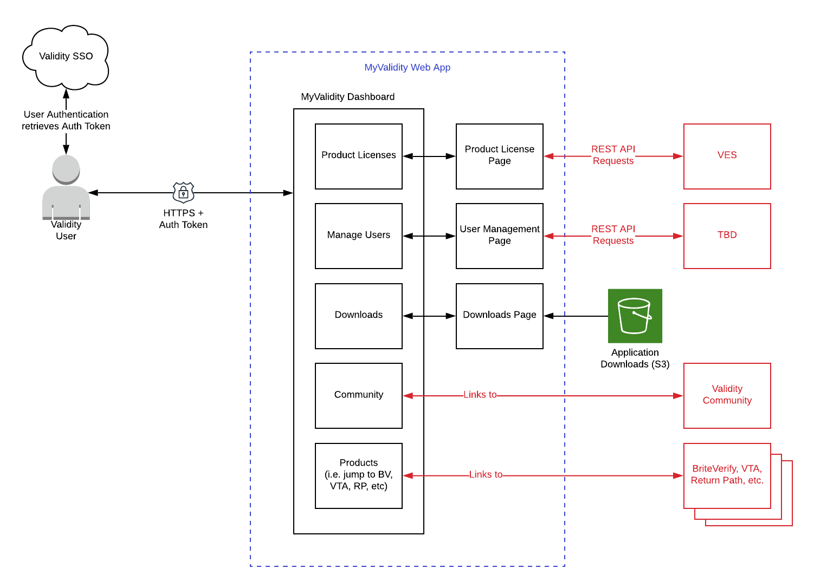
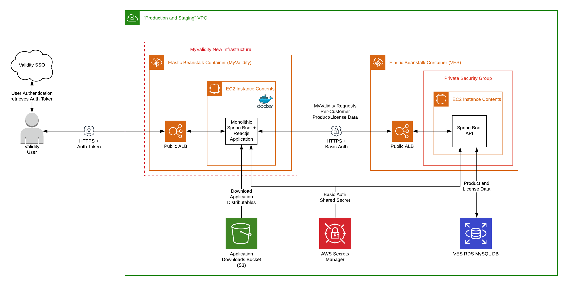

# MonolithStarter Design and Architecture

MonolithStarter is a customer-facing web application, which serves as a web portal to the Validity ecosystem. Current and planned features include, but are not limited to:

- Product license management
- User role management
- Links to Product distributable downloads (e.g VTA desktop application)
- Links to Community and Help resources
- Links to web-based Validity products (e.g. BriteVerify, Return Path, VTA)

# User and Data Flows

All customers must authenticate through Validity SSO to access the MonolithStarter web application. After
authenticating, customers can view and manage product licenses, users in the customer's account, and
download any product distributables, to which the customer has access.

The web application will also provide links to other Validity web applications and products, such as
the Validity Community portal and BriteVerify. The customer will not be required to re-authenticate
when directed to other Validity web applications, as they should already have a valid authentication
token through the Validity SSO flow.

# Architecture

MonolithStarter is a monolithic Spring Boot + Reactjs web application. The Spring Boot backend serves up
the Reactjs UI and any APIs required by the UI. The UI should leverage a CDN when appropriate.

The web application is deployed as a Docker container to Elastic Beanstalk running in the 
`validity-dev` AWS account and `Production and Staging` VPC. This is subject to change over time as the
`validity-dev` account is refactored into separate accounts and VPCs. The Elastic Beanstalk application
has a public-facing ALB to serve public internet traffic from Validity customers.

## Dependencies

The application currently has the following service dependencies:

| Dependency | Purpose |
| ---------- | ------- |
| Desktop App AWS S3 Bucket | Read access to Desktop application binaries to allow customers to download their products |
| VES REST API | Read current product license data for the relevant Validity account. This may be extended in the future to allow customers with administrator privileges to manage user access to different products. |
| AWS Secrets Manager | Access shared secret used for basic auth between MonolithStarter and the VES REST API |
| Route 53 | DNS and SSL certificates for `my.validity.com` and pre-production equivalents. |
